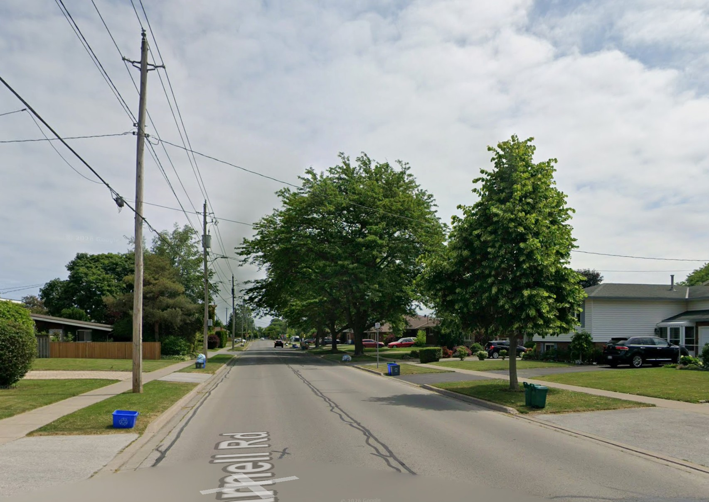
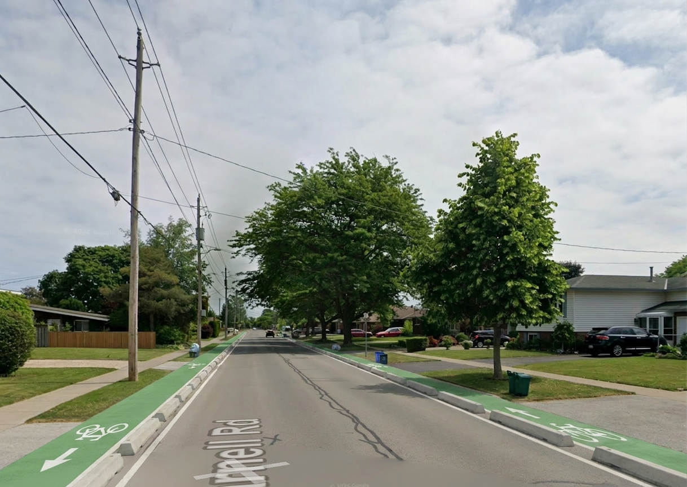

# StreetVision AI

Photorealistic **before/after visualizations of street interventions** (bike lanes, sidewalks, trees, street furniture) for public-consultation and Environmental Assessment materials — from a single photo of the real location plus a plain-text description of the proposed change.

Engineering and planning firms today choose between expensive manual renders (V-Ray/Twinmotion — days and hundreds of dollars per image) or free activist tools with a fixed aesthetic and no real project control. StreetVision AI sits in the gap: real site photo + AI-generated design variations + a workflow shaped for professional reports.

| Before (real photo) | After (generated) |
| --- | --- |
|  |  |

*Protected bike lanes on both sides — building facades, camera angle, lighting and the street name painted on the asphalt are preserved from the original photo.*

## Stack

- **Next.js 15** (App Router) + TypeScript + Tailwind CSS
- **Supabase**: Postgres (with RLS), Auth, Storage (private buckets + signed URLs), Edge Functions
- **Gemini 3 Pro Image** ("Nano Banana Pro") via `generateContent`, called only from a Supabase Edge Function — the Gemini API key never reaches the browser
- Interface in **3 languages** (English default, French, Portuguese) with a runtime switcher — no i18n library, just a dictionary + React Context

## Why Gemini 3 Pro Image (and not 2.5 Flash Image)

The project started on `gemini-2.5-flash-image` (~US$0.04/image). Validation with real street photos showed it **inconsistently corrupted text in the scene** — a street name painted on the asphalt came back as "Burnell"/"Bnell" instead of "Parnell", even with explicit character-by-character preservation instructions in the prompt. Since the output targets public consultation documents, text fidelity is non-negotiable. Switching to `gemini-3-pro-image` (~US$0.13/image) resolved it consistently — same API shape, one-line change, and the cost stays trivial under the built-in daily generation limit (5/user/day, enforced server-side in the Edge Function).

## Running locally

Prereqs: Node 18.18+, a Supabase project, and the [Supabase CLI](https://supabase.com/docs/guides/cli) logged in (`npx supabase login`).

```bash
npm install

# one-time backend setup (own Supabase project):
npx supabase link --project-ref <your-project-ref>
npx supabase db push                                  # tables, RLS, storage buckets
npx supabase functions deploy generate-image --use-api
npx supabase secrets set GEMINI_API_KEY=<your-key>    # server-side only

# frontend env (.env.local) — fetches keys via the logged-in CLI:
node scripts/setup-env.mjs

npm run dev
```

Then open http://localhost:3000, create an account (email confirmation required), create a project with a street photo, describe the intervention and generate.

> `scripts/` also contains a manual test harness for the Edge Function (`setup-test.mjs` + `test-generate.mjs`) used to validate prompt fidelity before any UI existed.

## Notes

- **Cost control**: every generation is metered — the Edge Function checks and increments a per-user daily quota (`generation_limits`) *server-side*, so it can't be bypassed by calling the API directly.
- **Impact metrics are simulated**: the stat cards and "Proposal Elements" list show fixed example values, clearly badged "SIMULATED DATA" in the UI (`lib/mockImpact.ts` documents the contract for swapping in real calculations later).
- The prompt template explicitly instructs preservation of building facades, camera angle, lighting and all existing text/signage — see `supabase/functions/generate-image/index.ts`.
